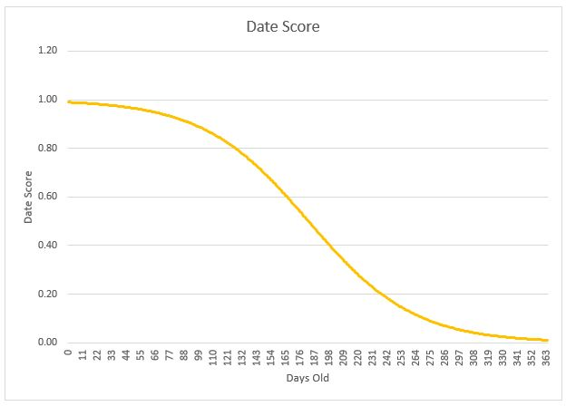
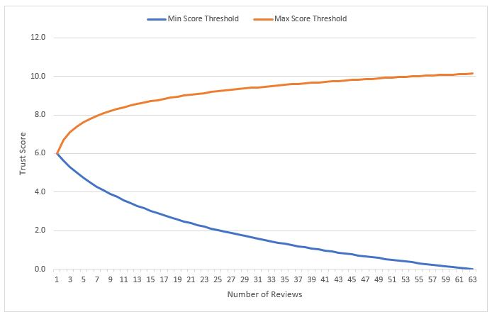

# trustpilot-api-challenge
This is my attempt at [Trust Pilot's API challenge](http://followthewhiterabbit.trustpilot.com/api/challenge.html).

## The function
The lambda function is setup to receive two query string parameters from api gateway: a `domain` parameter and an optional `limit` parameter. The `domain` parameter is the domain of the company that you would like to calculate the trust score for. The `limit` parameter is to only look at the last "X" reviews when calculating the score. If this is not specified it defaults to 300. Here are two example query strings:

```
?domain=example.co.uk
?domain=example.co.uk&limit=50
```

Successful calls will return a JSON object in the below form. 

```
{
  "domain": "example.co.uk",
  "limit": 100,
  "trust_score": 9.3
}
```


## How it works
The process is the same as what's outlined in the original challenge: first a request is made to Trust Pilot's API to get the business unit for the target domain, then the reviews are obtained for that business unit. Trust Pilot implements pagination on the reviews, so the reviews will be retrieved for each page until either the limit is reached or the last page has.

Next the process loops through each review in this review set and if the review counts towards the trust score (according to Trust Pilot's API), it calculates a numerical score for it. The maximum possible score available is also calculated and stored.

Once all the reviews have been processed, I calculate the overall trust score (see below), and perform a quality check to make sure it's within certain thresholds, to stop companies with only a handful of reviews scoring really highly or really badly.


### Scoring a review
A review is scored by considering the age of the review and the number of stars given. The scores are both obtained for the number of stars and the age of the review (the date score) and these are multiplied together to give the review score.

A 5 star review would be the perfect star score, and this is scored as 1, so therefore the maximum score available for that review is `the_date_score * 1 = the_date_score`.

Both the review score and the date score are returned.

#### Star score
The star score is simple: reviews can only be scored 1 to 5, so the star score is simply:

| Stars |  Score |
| :---: |:------:|
|   5   |    1   |
|   4   |  0.75  |
|   3   |  0.50  |
|   2   |  0.25  |
|   1   |    0   |

#### Date Score
The date score is more challenging. I've modelled this score on a logistic function, that's been slightly transformed, so reviews that are newer are scored closer to 1 and older reviews are scored closer to 0.

An example of how the date score looks is shown in the below image.



*NOTE: Since producing this image, I've updated the logistic function parameters, so this image doesn't accurately show what the function looks like. However the principles are the same as the shape is similar, but the gradient of the slope is far more gentle in my current function.*


### Calculating the trust score
The trust score itself is simply the total score achieved by all the reviews, divided by the total possible score available; it's a percentage. I then translate this to the Trust Pilot scale, so rather than being out of 100, it's out of 10. Taking this approach means that over time reviews will be weighted less and less towards the final score, however the score itself would remain unchanged if no new reviews are left for the company. 

The algorithm then checks to make sure that the score is between the min and max thresholds, and if it is it returns, but if it isn't it returns the minimum threshold if it's less than the min, or the maximum threshold if it's more than the max. As explained above, this prevents a company with 1 five star review, scoring a perfect 10.

The thresholds I've modelled on two translated log functions based on the number of reviews, that can be seen in the image below:




## Results
I've run several tests on random companies selected from Trust Pilot's website, with a high limit, so as to consider all reviews, and I've found that my trust score is either correct or very close for companies that have a lot of reviews, usually within approx 0.2, but this drifts a little for companies with less reviews. I originally assumed that this was because of my thresholds, but that doesn't always appear to be the case. It seems that I'm missing a piece of the jigsaw puzzle.

*A side note: I originally created the review score to consider whether a review was verified or not, and applied a weighted average of this and the star score, with the verified score weight being very small. However, this gave me very inaccurate results, but removing increased the accuracy a lot. It makes me wonder if Trust Pilot consider if reviews are verified in their ranking algorithm, because I find it surprising if they're not.*
